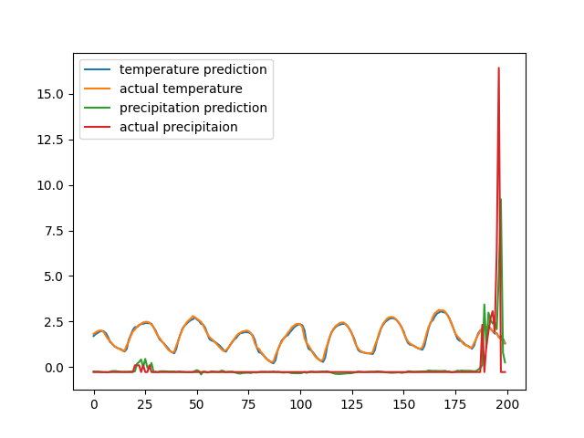

# LSTM Weather Forecasting

All data used for training and testing can be found in data folder and was taken from the Open-Meteo Historical Weather API. lstm1.py trains the network that takes all sorts of data (details in parameters.txt) from 6 consecutive hours to predict the temperature and precipitaion in the next hour. Can be increased and retrained to take data from more than 6 hours by altering the past variable in lstm1 and running the script to produce a more accurate network if needed. The model is saved in model1. The result can be seen by running test.py.

To come up with the variables I used to predict the weather I found that you could plot the correlation between the various variables and discarded any which were too similar to other variables and took ones that looked like it affected the temperature/precipitaion.

